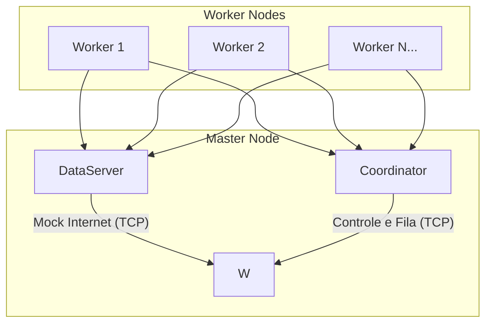

# 🕷️ Distributed Web Crawler (P1)

Um sistema de Web Crawler distribuído de alta performance, projetado para escalar horizontalmente em múltiplas máquinas utilizando Docker e comunicação via Sockets TCP. Este projeto simula um ambiente real de crawling, incluindo um servidor de dados (Mock Internet), um coordenador central e múltiplos workers paralelos.

---

## 🏗️ Arquitetura do Sistema

O sistema é dividido em três componentes principais que se comunicam através de um protocolo de rede personalizado:



### 1. 📂 DataServer (The Internet)
Responsável por simular a internet servindo páginas HTML e links via Sockets.
- **Performance**: Utiliza `HashMap` para acesso O(1) e `CachedThreadPool` para lidar com centenas de conexões simultâneas.
- **Data Source**: Carrega os dados a partir de um arquivo `mock_internet.csv`.

### 2. 🎮 Coordinator (The Master)
O cérebro do sistema, gerenciando o estado global.
- **Gerenciamento de Fila**: Utiliza `LinkedBlockingQueue` para distribuição de tarefas.
- **Idempotência**: Mantém um `ConcurrentHashMap.newKeySet()` para garantir que nenhuma URL seja processada duas vezes.
- **Sincronização**: Usa `AtomicInteger` para rastrear o progresso e determinar o encerramento seguro do sistema.

### 3. 🛠️ Worker (The Heavy Lifter)
O cliente que executa o processamento pesado e parseamento.
- **Concorrência**: Utiliza `FixedThreadPool` e `Semaphore` para controle de fluxo (Backpressure), evitando sobrecarga de memória.
- **Programação Funcional**: Implementa filtros e validações utilizando a API de **Java Streams** e `Predicates`.

---

## 🚀 Como Executar

### Pré-requisitos
- Docker & Docker Compose
- Java 26+ (conforme definido no pom.xml)
- Maven (se rodar localmente)

### Opção A: Rodando com Docker (Recomendado)

Para iniciar todo o ecossistema (DataServer, Coordinator e 4 Workers):

```bash
docker-compose up --build
```

### Opção B: Rodando Localmente

1. **Compilar o projeto**:
   ```bash
   mvn clean package
   ```

2. **Iniciar o DataServer**:
   ```bash
   java -cp target/web_crawler_p1-1.0-SNAPSHOT.jar com.crawler.dataserver.DataServer
   ```

3. **Iniciar o Coordinator**:
   ```bash
   java -cp target/web_crawler_p1-1.0-SNAPSHOT.jar com.crawler.coordinator.Coordinator
   ```

4. **Iniciar os Workers**:
   ```bash
   java -cp target/web_crawler_p1-1.0-SNAPSHOT.jar com.crawler.worker.Worker
   ```

---

## ⚙️ Configuração

A configuração é feita através do arquivo `config.txt` ou via variáveis de ambiente (no Docker).

| Propriedade | Descrição | Padrão |
| :--- | :--- | :--- |
| `COORD_HOST` | Host do Coordenador | `localhost` |
| `COORD_PORT` | Porta do Coordenador | `8080` |
| `DATA_HOST` | Host do DataServer | `localhost` |
| `DATA_PORT` | Porta do DataServer | `8081` |
| `WORKER_THREADS` | Threads por Worker | `4` |

---

## 🛠️ Tecnologias Utilizadas

- **Java 26**: Core da aplicação.
- **Maven**: Gerenciamento de dependências.
- **Docker & Docker Compose**: Orquestração e containerização.
- **TCP Sockets**: Comunicação inter-processos.
- **Java Streams**: Processamento funcional de dados.
- **Semáforos & Atomics**: Sincronização thread-safe de baixo nível.

---

## 📝 Documentação Adicional

Para detalhes técnicos sobre a implementação de cada classe, consulte:
- [Detalhamento de Classes](src/docs/classes.md)
